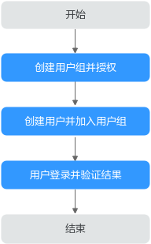

# 创建用户并授权使用ESW

如果您需要对您所拥有的ESW进行精细的权限管理，您可以使用统一身份认证服务（Identity and Access Management，简称IAM），通过IAM，您可以：

-   根据企业的业务组织，在您的华为云帐号中，给企业中不同职能部门的员工创建IAM用户，让员工拥有唯一安全凭证，并使用ESW资源。
-   根据企业用户的职能，设置不同的访问权限，以达到用户之间的权限隔离。
-   将ESW资源委托给更专业、高效的其他华为云帐号或者云服务，这些华为云帐号或者云服务可以根据权限进行代运维。

如果华为云帐号已经能满足您的要求，不需要创建独立的IAM用户，您可以跳过本章节，不影响您使用ESW服务的其它功能。

IAM是华为云提供权限管理的基础服务，无需付费即可使用，您只需要为您帐号中的资源进行付费。关于IAM的详细介绍，请参见[《IAM产品介绍》](https://support.huaweicloud.com/productdesc-iam/iam_01_0026.html)。

本章节为您介绍对用户授权的方法，操作流程如[图1](#fig1351611812271)所示。

## 前提条件

给用户组授权之前，请您了解用户组可以添加的ESW权限，并结合实际需求进行选择，ESW服务没有独立的系统权限，和VPC共用一套系统权限，请参见：[ESW系统权限](https://support.huaweicloud.com/productdesc-esw/esw_pd_0007.html)。若您需要对除ESW之外的其它服务授权，IAM支持服务的所有权限请参见[系统权限](https://support.huaweicloud.com/permissions/policy_list.html?product=vpc)。

## 示例流程

**图 1**  给用户授予ESW权限流程  

1.  [创建用户组并授权](https://support.huaweicloud.com/usermanual-iam/iam_03_0001.html)

    在IAM控制台创建用户组，并授予VPC_只读_权限“VPCReadOnlyAccess”。

2.  [创建用户并加入用户组](https://support.huaweicloud.com/usermanual-iam/iam_02_0001.html)

    在IAM控制台创建用户，并将其加入[1](#li10176121316284)中创建的用户组。

3.  [用户登录](https://support.huaweicloud.com/usermanual-iam/iam_01_0552.html)并验证权限。

    新创建的用户登录控制台，切换至授权区域，验证权限：

    -   在“服务列表”中选择企业交换机，进入ESW主界面，单击右上角“购买”，尝试购买企业交换机，如果无法购买企业交换机（假设当前权限仅包含VPCReadOnlyAccess），表示“VPCReadOnlyAccess”已生效。
    -   在“服务列表”中选择弹性云服务器（假设当前策略仅包含VPCReadOnlyAccess），若提示权限不足，表示“VPCReadOnlyAccess”已生效。

